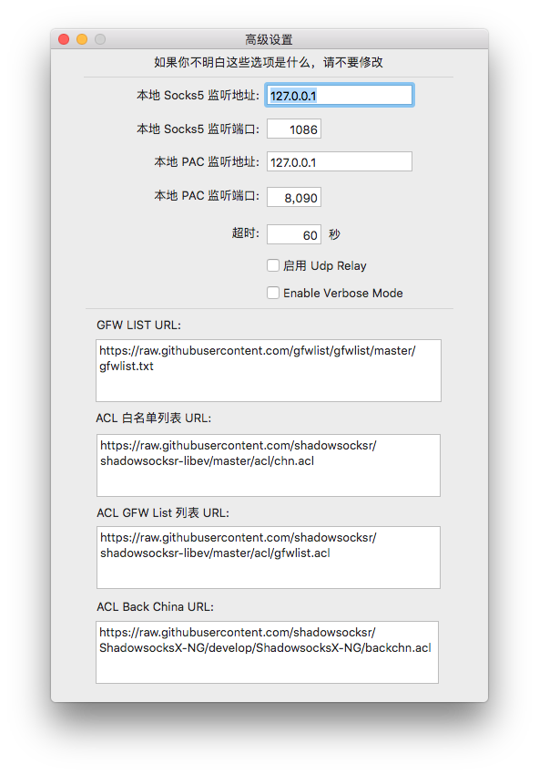
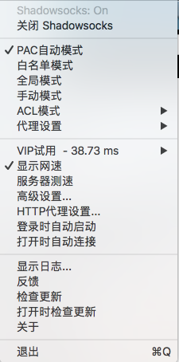

# git 设置代理
`概述，自从github被收购后，发现中国大陆访问异常慢` 

* 首先你需要有你自己的代理，也就是梯子（科学上网）
    步骤 ，这是设置全局的代理，也就是说你所有的Git都是你电脑的代理
    
```
git config –global http.proxy socks5://127.0.0.1:1080 
```
如果只想让GitHub设置该代理

```
git config --global http.https://github.com.proxy socks5://127.0.0.1:1087
```

* 如何查看本机代理端口号
    选择你的代理，查看高级=》端口号
    



* 取消代理设置
    
```
git config --global --unset http.proxy 
```


```
git config --global -unset http.https://github.com.proxy 
```


